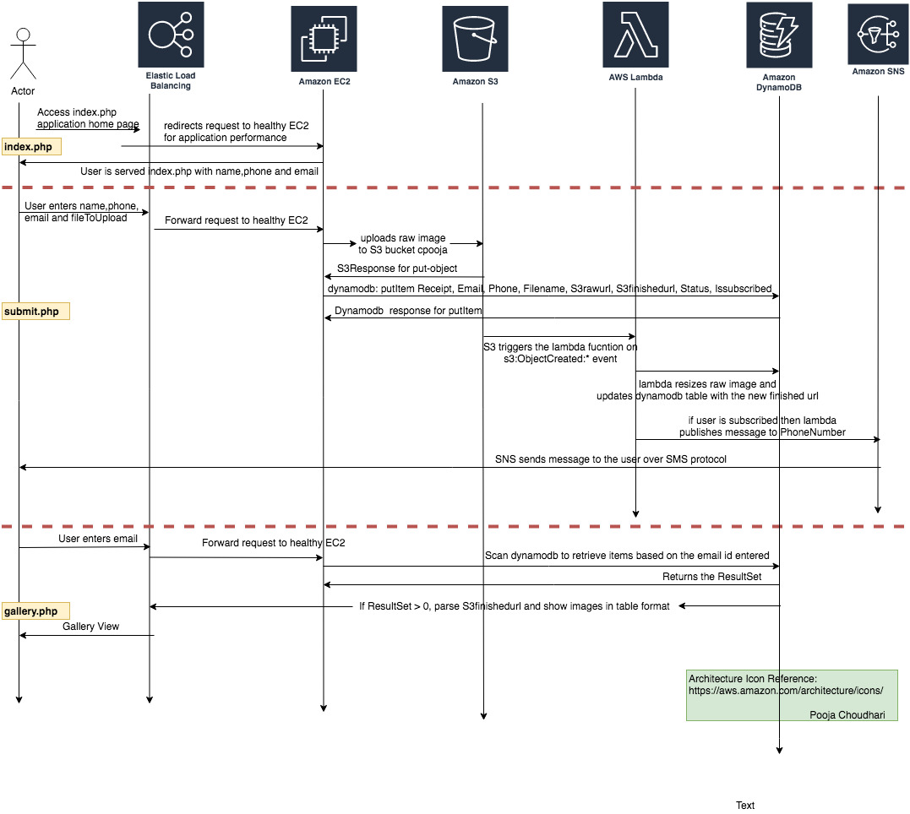
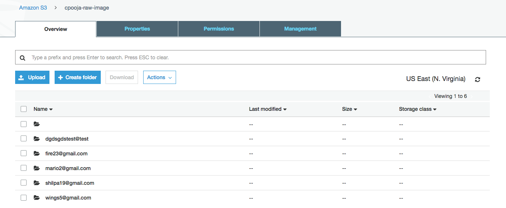

# Cloud Native Deployment Web Application

### Abstract
The purpose of this project is to demonstrate automating cloud native service and deploy web application running on AWS infrastructure. In this project, we have used 6 AWS services Elastic Load Balancer(ELB), Elastic Compute Cloud(EC2), Amazon Simple Storage Service(S3),Amazon lambda, Amazon DynamoDB and Amazon SNS. The complete infrastructure has been automated using AWS CLI. The application is developed in PHP and aws lambda function is using Python 3.6 runtime and we have used the AWS PHP SDK to integrate all the mentioned services in our application. 

### Application Design

### Application Workflow
The application is served at ELB-address://index.php, where the user has the option to either view the gallery or upload an image to process the image. The index.php has 3 form options and displays the processed images (Thumbnail) in the gallery.php and posts raw image to S3, processese raw image to thumbnail image. 

User enters email to view gallery, a Dynamodb Scan is fired on the table filtered with user entered email. If records are found processed thumbnail image are returned in tabular format. If no records are found an appropriate message is displayed to the user. The gallery.php has the home button which redirects the user to the index.php

User enter email, phone, name and file for processing, the submit.php is responsible to upload raw image to raw S3 bucket, putItem to Dynamodb. S3 Putobject trigger event fires a Lambda function which processes the raw image to the Thumbnail image and updates the same Dynamodb record with receipt and email. Then it stores the transaction metadata in the table for easy retrieval to view in the gallery.

### Infrastrcuture Deployment Plan
#### Usage: 
    ./create-env.sh <ami-id> <count> <instance-type> <keypair-name> <security-group-ids> <ec2-iam-role-name> <subnet-id> <lambda-iam-role-arn>"

    Example:
    ./create-env.sh  ami-072ba2e0afdd77177 1 t2.micro ubuntu-inclass-2019 sg-0eb6bf6a9bb1bc8d6 EC2-access-services-role subnet-824c7bde arn:aws:iam::<account-id>:role/lambda-cli-role

#### Setup

- **dynamodb create-table**: Creates an Dynamodb table that maintains the data used by a web application. The dynamodb waiter will then poll table-exists to be fully available.

- **elb create-load-balancer**: Creates the load balancer, then following that we configure a custom health check to the applications index.php page. Create a cookie stickiness policy and set-load-balancer-policies-of-listener with the sticky policy. This is to ensure that each user gets a consistent view of the application for the duration of the cookie expire time or browser session

- **autoscaling create-launch-configuration**: A launch configuration is an instance configuration template that an Auto Scaling group uses to launch EC2 instances. It defines all the required parameters that you might need to use on EC2.

- **autoscaling create-auto-scaling-group**: The create-auto-scaling-group uses the launch configuration to get necessary information to configure the Amazon EC2 instances, the subnets for the instances, and the initial number of instances.

- **sns create-topic**: Creates a topic to subscribe and send users sms notification.

- **lambda create-function**: Serverless function that processes images, updates dynamodb table and sends out a notification to the user subscribed to the above topic.

- **s3api put-bucket-notification-configuration**: Set an s3:ObjectCreated:* event on the S3 raw bucket to trigger lambda function on any user requested form upload

- **elb wait instance-in-service**: Register AutoScaling InstancesEC2 instances from Step2 to the ELB, for user traffic routing and balancing. The ELB waiter than polls the EC2 instance with the configured health check to register each EC2 instance as "inService".

#### Destroy
- **autoscaling update-auto-scaling-group**: 
The output from describe-instances catpures all pending/running EC2 istances and terminates all the EC2 instances.

- **elb delete-load-balancer**: The output from describe-load-balancer captures all ELB instances and de-registers and deletes all the EC2 instances.

- **dynamodb delete-table**: The output from describe-db-instance captures all RDS instances and deletes all the RDS instances.

- **sns delete-topic**: Deletes the topic and its subscription. 

- ***lambda delete-function**: Delete the lambda function.

**Note: Too often the client server clock gets skewed and we have to run NTP sync at the start to avoid deployment/destroy script failures.**

### Implementation Consideration

 - **Cross Account Image Collision** Uploading of image with email prefixed, such that each user gets his own image namespace and does not collide with other users. Lets say user1@gmail.com has jerry.png which is actually jerry's photo but then another user2@gmail.com mischievous enough stores Tom's image and names it as jerry.png then the both user1 and user2 will be served Tom's image since S3 will overwrite the original object with the latest copy. To solve the issue each user is given a unique namespace prefixed with their own email and then store images underneath, so each user gets a unique copy of their image.

 

 - Optimized raw image processing locally on the server to reduce round trip updates to RDS. This is a an performance consideration.

 ### Custom Amazon Machine Image(AMI) - ami-072ba2e0afdd77177
In order to clone our private application onto AWS servers in an automated fashion, we had to create our own custom image with our github SSH keys embedded inside the image, for seamless cloning of the repo through automation. The same has been shared with professor's AWS account.